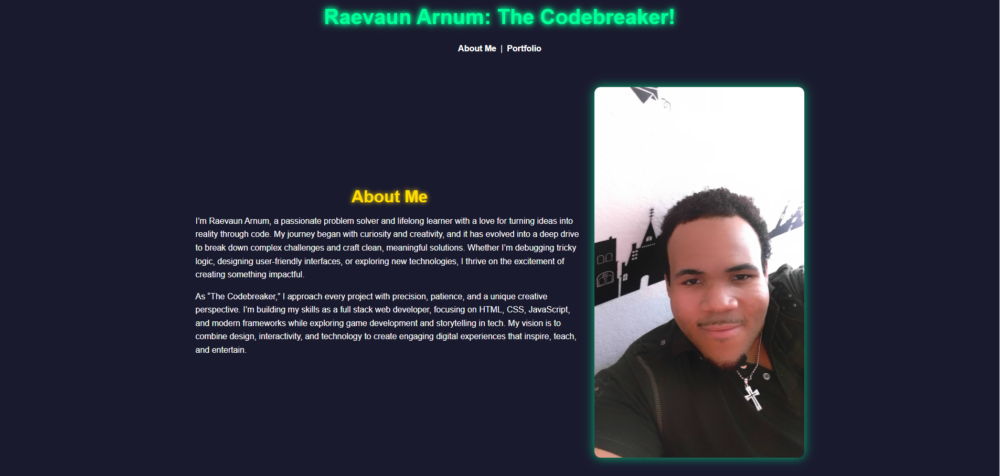

# Simple Site Design

A responsive, visually engaging personal landing page built with **HTML** and **CSS**.  
This project features neon glowing headings, a pulsing hover underline, alternating glow colors, and a clean two-column layout with text on the left and an image on the right. It demonstrates modern front-end design principles and interactive UI elements.

---

## Demo




Live demo: [GitHub Pages Link](https://codebreaker8609.github.io/simple-site-design/)

---

## Features

- **Responsive two-column layout:** Text on the left, image on the right, stacks vertically on smaller screens.  
- **Neon glowing headings:** `<h1>` and `<h2>` elements with glow effects.  
- **Pulsing underline:** Animated underline appears on hover for `<h1>`.  
- **Alternating glow colors:** Hover animations cycle through neon colors for text and underline.  
- **Interactive navigation:** Links change glow color on hover.  
- **Mobile-friendly:** Fully responsive across desktop, tablet, and mobile devices.  

---

## Technologies Used

- HTML5  
- CSS3 (Flexbox, animations, pseudo-elements)  
- Responsive design best practices  

---

## Installation

1. Clone the repository:
```bash
git clone https://github.com/YourUsername/simple-site-design.git
Open index.html in your web browser.

Optional: Deploy via GitHub Pages for a live demo.

Usage
Perfect as a personal landing page or portfolio introduction.

Replace text and images to personalize your site.

Add more sections, projects, or links as needed.

Screenshots
Desktop	Mobile


About This Project
Simple Site Design demonstrates my front-end development skills and creativity. It showcases my ability to build polished, interactive web pages with clean layout, responsive design, and modern CSS animations. The project highlights attention to detail, visual design sense, and understanding of user-friendly interfaces.

Credits
Inspired by Community Taught Simple Site Lab

Built by Raevaun Arnum

